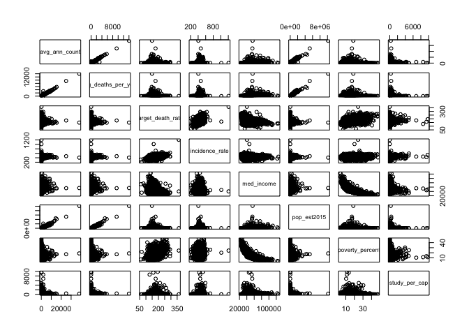

EDA
================
Alyssa Vanderbeek
12/6/2018

I looked at the following variables:

TARGET\_deathRate: Dependent variable. Mean per capita (100,000) cancer mortalities(a)

avgAnnCount: Mean number of reported cases of cancer diagnosed annually(a)

avgDeathsPerYear: Mean number of reported mortalities due to cancer(a)

incidenceRate: Mean per capita (100,000) cancer diagnoses(a)

medianIncome: Median income per county (b)

popEst2015: Population of county (b)

povertyPercent: Percent of population in poverty (b)

studyPerCap: Per capita number of cancer-related clinical trials per county (a)

binnedInc: Median income per capita binned by decile (b)

In examining the associations between variables, we see that the outcome of interest ("target\_death\_rate") is linearly correlated with a county's cancer incidence rate, median income, and percentage of the population in poverty.

However, we can see that there's some association between covariates. Avg\_ann\_count, avg\_deaths\_per\_year, and pop\_est2015 are nearly perfectly correlated. Med\_income and poverty\_percent are also related, as can be seen by an exponential relationship.

``` r
cancer %>% select(-binned_inc) %>% pairs
```



After looking at the distribution of the variables here, we should perform a log transformation on avg\_ann\_count, avg\_deaths\_per\_year, and pop\_est2015. The other variables are relatively normally distributed.

``` r
cancer = cancer %>%
  mutate(log_ann_count = log(avg_ann_count),
         log_deaths_yr = log(avg_deaths_per_year),
         log_pop = log(pop_est2015))
```
