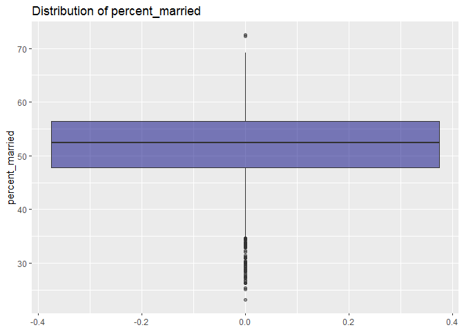
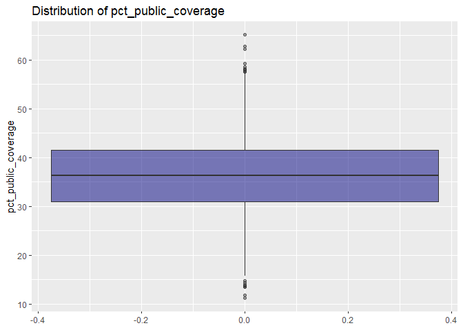

Exploratory analysis
================
Haoran Hu
2018-12-9

``` r
cancer_data = read_csv("..\\data\\Cancer_Registry.csv") %>% 
  janitor::clean_names() %>% 
  dplyr::select(-geography, -binned_inc)
```

    ## Parsed with column specification:
    ## cols(
    ##   .default = col_double(),
    ##   avgDeathsPerYear = col_integer(),
    ##   medIncome = col_integer(),
    ##   popEst2015 = col_integer(),
    ##   binnedInc = col_character(),
    ##   Geography = col_character()
    ## )

    ## See spec(...) for full column specifications.

``` r
cancer_data %>% 
  filter(!is.na(pct_employed16_over)) %>% 
  cor() %>% 
  knitr::kable(digits = 3)
```

|                               |  avg\_ann\_count|  avg\_deaths\_per\_year|  target\_death\_rate|  incidence\_rate|  med\_income|  pop\_est2015|  poverty\_percent|  study\_per\_cap|  median\_age|  median\_age\_male|  median\_age\_female|  avg\_household\_size|  percent\_married|  pct\_no\_hs18\_24|  pct\_hs18\_24|  pct\_some\_col18\_24|  pct\_bach\_deg18\_24|  pct\_hs25\_over|  pct\_bach\_deg25\_over|  pct\_employed16\_over|  pct\_unemployed16\_over|  pct\_private\_coverage|  pct\_private\_coverage\_alone|  pct\_emp\_priv\_coverage|  pct\_public\_coverage|  pct\_public\_coverage\_alone|  pct\_white|  pct\_black|  pct\_asian|  pct\_other\_race|  pct\_married\_households|  birth\_rate|
|-------------------------------|----------------:|-----------------------:|--------------------:|----------------:|------------:|-------------:|-----------------:|----------------:|------------:|------------------:|--------------------:|---------------------:|-----------------:|------------------:|--------------:|---------------------:|---------------------:|----------------:|-----------------------:|----------------------:|------------------------:|-----------------------:|------------------------------:|-------------------------:|----------------------:|-----------------------------:|-----------:|-----------:|-----------:|-----------------:|-------------------------:|------------:|
| avg\_ann\_count               |            1.000|                   0.941|               -0.144|            0.079|        0.271|         0.929|            -0.136|            0.079|       -0.024|             -0.127|               -0.126|                 0.068|            -0.107|             -0.142|         -0.182|                    NA|                 0.284|           -0.311|                   0.323|                  0.199|                   -0.007|                   0.130|                             NA|                     0.202|                 -0.173|                        -0.091|      -0.140|       0.031|       0.436|             0.211|                    -0.107|       -0.034|
| avg\_deaths\_per\_year        |            0.941|                   1.000|               -0.091|            0.068|        0.227|         0.979|            -0.068|            0.060|       -0.025|             -0.153|               -0.150|                 0.090|            -0.181|             -0.137|         -0.152|                    NA|                 0.260|           -0.297|                   0.297|                  0.126|                    0.071|                   0.056|                             NA|                     0.162|                 -0.134|                        -0.027|      -0.190|       0.083|       0.445|             0.218|                    -0.160|       -0.073|
| target\_death\_rate           |           -0.144|                  -0.091|                1.000|            0.429|       -0.427|        -0.120|             0.425|           -0.020|       -0.001|             -0.025|                0.010|                -0.040|            -0.258|              0.080|          0.261|                    NA|                -0.286|            0.404|                  -0.483|                 -0.412|                    0.374|                  -0.385|                             NA|                    -0.264|                  0.402|                         0.448|      -0.165|       0.253|      -0.186|            -0.190|                    -0.286|       -0.088|
| incidence\_rate               |            0.079|                   0.068|                0.429|            1.000|        0.012|         0.031|            -0.001|            0.083|        0.010|             -0.022|               -0.012|                -0.122|            -0.115|             -0.190|          0.015|                    NA|                 0.060|            0.115|                  -0.020|                  0.005|                    0.092|                   0.115|                             NA|                     0.160|                  0.037|                         0.032|      -0.009|       0.116|      -0.007|            -0.214|                    -0.157|       -0.116|
| med\_income                   |            0.271|                   0.227|               -0.427|            0.012|        1.000|         0.237|            -0.789|            0.044|       -0.016|             -0.088|               -0.150|                 0.108|             0.350|             -0.289|         -0.191|                    NA|                 0.493|           -0.471|                   0.710|                  0.693|                   -0.452|                   0.725|                             NA|                     0.749|                 -0.755|                        -0.719|       0.163|      -0.267|       0.423|             0.084|                     0.441|       -0.014|
| pop\_est2015                  |            0.929|                   0.979|               -0.120|            0.031|        0.237|         1.000|            -0.065|            0.053|       -0.025|             -0.178|               -0.181|                 0.112|            -0.162|             -0.126|         -0.152|                    NA|                 0.248|           -0.312|                   0.299|                  0.140|                    0.052|                   0.051|                             NA|                     0.159|                 -0.160|                        -0.040|      -0.193|       0.072|       0.464|             0.243|                    -0.130|       -0.057|
| poverty\_percent              |           -0.136|                  -0.068|                0.425|           -0.001|       -0.789|        -0.065|             1.000|           -0.057|       -0.028|             -0.219|               -0.151|                 0.075|            -0.640|              0.288|          0.095|                    NA|                -0.386|            0.194|                  -0.533|                 -0.737|                    0.653|                  -0.822|                             NA|                    -0.681|                  0.650|                         0.797|      -0.504|       0.511|      -0.156|             0.047|                    -0.603|       -0.008|
| study\_per\_cap               |            0.079|                   0.060|               -0.020|            0.083|        0.044|         0.053|            -0.057|            1.000|       -0.025|             -0.035|               -0.030|                -0.002|            -0.035|             -0.089|         -0.055|                    NA|                 0.061|           -0.081|                   0.106|                  0.088|                   -0.033|                   0.093|                             NA|                     0.100|                 -0.051|                        -0.056|       0.027|      -0.023|       0.059|            -0.016|                    -0.048|        0.012|
| median\_age                   |           -0.024|                  -0.025|               -0.001|            0.010|       -0.016|        -0.025|            -0.028|           -0.025|        1.000|              0.135|                0.131|                -0.037|             0.047|              0.004|          0.049|                    NA|                -0.014|            0.038|                  -0.022|                 -0.025|                    0.013|                   0.006|                             NA|                    -0.039|                  0.054|                        -0.004|       0.040|      -0.013|      -0.037|            -0.027|                     0.013|       -0.010|
| median\_age\_male             |           -0.127|                  -0.153|               -0.025|           -0.022|       -0.088|        -0.178|            -0.219|           -0.035|        0.135|              1.000|                0.933|                -0.340|             0.459|              0.102|          0.240|                    NA|                -0.032|            0.314|                  -0.129|                 -0.165|                   -0.140|                   0.083|                             NA|                    -0.214|                  0.395|                        -0.005|       0.401|      -0.251|      -0.239|            -0.271|                     0.233|       -0.096|
| median\_age\_female           |           -0.126|                  -0.150|                0.010|           -0.012|       -0.150|        -0.181|            -0.151|           -0.030|        0.131|              0.933|                1.000|                -0.363|             0.381|              0.140|          0.240|                    NA|                -0.069|            0.341|                  -0.181|                 -0.251|                   -0.105|                   0.047|                             NA|                    -0.258|                  0.452|                         0.042|       0.342|      -0.163|      -0.261|            -0.279|                     0.172|       -0.093|
| avg\_household\_size          |            0.068|                   0.090|               -0.040|           -0.122|        0.108|         0.112|             0.075|           -0.002|       -0.037|             -0.340|               -0.363|                 1.000|            -0.103|              0.058|          0.032|                    NA|                -0.060|           -0.136|                   0.012|                  0.012|                    0.130|                  -0.144|                             NA|                     0.010|                 -0.131|                         0.065|      -0.192|       0.040|       0.135|             0.233|                     0.088|        0.072|
| percent\_married              |           -0.107|                  -0.181|               -0.258|           -0.115|        0.350|        -0.162|            -0.640|           -0.035|        0.047|              0.459|                0.381|                -0.103|             1.000|             -0.011|          0.135|                    NA|                 0.047|            0.106|                   0.098|                  0.405|                   -0.548|                   0.444|                             NA|                     0.224|                 -0.241|                        -0.454|       0.676|      -0.626|      -0.152|            -0.109|                     0.870|        0.135|
| pct\_no\_hs18\_24             |           -0.142|                  -0.137|                0.080|           -0.190|       -0.289|        -0.126|             0.288|           -0.089|        0.004|              0.102|                0.140|                 0.058|            -0.011|              1.000|          0.085|                    NA|                -0.383|            0.218|                  -0.397|                 -0.345|                    0.182|                  -0.452|                             NA|                    -0.428|                  0.321|                         0.327|      -0.158|       0.122|      -0.217|             0.127|                     0.005|        0.124|
| pct\_hs18\_24                 |           -0.182|                  -0.152|                0.261|            0.015|       -0.191|        -0.152|             0.095|           -0.055|        0.049|              0.240|                0.240|                 0.032|             0.135|              0.085|          1.000|                    NA|                -0.389|            0.440|                  -0.406|                 -0.270|                    0.135|                  -0.257|                             NA|                    -0.246|                  0.277|                         0.234|       0.046|      -0.026|      -0.201|            -0.064|                     0.125|        0.058|
| pct\_some\_col18\_24          |               NA|                      NA|                   NA|               NA|           NA|            NA|                NA|               NA|           NA|                 NA|                   NA|                    NA|                NA|                 NA|             NA|                     1|                    NA|               NA|                      NA|                     NA|                       NA|                      NA|                             NA|                        NA|                     NA|                            NA|          NA|          NA|          NA|                NA|                        NA|           NA|
| pct\_bach\_deg18\_24          |            0.284|                   0.260|               -0.286|            0.060|        0.493|         0.248|            -0.386|            0.061|       -0.014|             -0.032|               -0.069|                -0.060|             0.047|             -0.383|         -0.389|                    NA|                 1.000|           -0.388|                   0.603|                  0.466|                   -0.309|                   0.489|                             NA|                     0.451|                 -0.421|                        -0.420|       0.069|      -0.097|       0.343|             0.008|                    -0.005|       -0.125|
| pct\_hs25\_over               |           -0.311|                  -0.297|                0.404|            0.115|       -0.471|        -0.312|             0.194|           -0.081|        0.038|              0.314|                0.341|                -0.136|             0.106|              0.218|          0.440|                    NA|                -0.388|            1.000|                  -0.742|                 -0.347|                    0.083|                  -0.225|                             NA|                    -0.226|                  0.425|                         0.295|       0.190|      -0.026|      -0.436|            -0.284|                     0.068|        0.018|
| pct\_bach\_deg25\_over        |            0.323|                   0.297|               -0.483|           -0.020|        0.710|         0.299|            -0.533|            0.106|       -0.022|             -0.129|               -0.181|                 0.012|             0.098|             -0.397|         -0.406|                    NA|                 0.603|           -0.742|                   1.000|                  0.617|                   -0.370|                   0.606|                             NA|                     0.545|                 -0.636|                        -0.607|       0.044|      -0.144|       0.440|             0.039|                     0.094|       -0.093|
| pct\_employed16\_over         |            0.199|                   0.126|               -0.412|            0.005|        0.693|         0.140|            -0.737|            0.088|       -0.025|             -0.165|               -0.251|                 0.012|             0.405|             -0.345|         -0.270|                    NA|                 0.466|           -0.347|                   0.617|                  1.000|                   -0.648|                   0.699|                             NA|                     0.703|                 -0.771|                        -0.712|       0.270|      -0.337|       0.234|             0.049|                     0.315|        0.082|
| pct\_unemployed16\_over       |           -0.007|                   0.071|                0.374|            0.092|       -0.452|         0.052|             0.653|           -0.033|        0.013|             -0.140|               -0.105|                 0.130|            -0.548|              0.182|          0.135|                    NA|                -0.309|            0.083|                  -0.370|                 -0.648|                    1.000|                  -0.631|                             NA|                    -0.472|                  0.531|                         0.653|      -0.496|       0.475|      -0.021|             0.028|                    -0.467|       -0.064|
| pct\_private\_coverage        |            0.130|                   0.056|               -0.385|            0.115|        0.725|         0.051|            -0.822|            0.093|        0.006|              0.083|                0.047|                -0.144|             0.444|             -0.452|         -0.257|                    NA|                 0.489|           -0.225|                   0.606|                  0.699|                   -0.631|                   1.000|                             NA|                     0.827|                 -0.722|                        -0.888|       0.423|      -0.344|       0.187|            -0.178|                     0.430|       -0.044|
| pct\_private\_coverage\_alone |               NA|                      NA|                   NA|               NA|           NA|            NA|                NA|               NA|           NA|                 NA|                   NA|                    NA|                NA|                 NA|             NA|                    NA|                    NA|               NA|                      NA|                     NA|                       NA|                      NA|                              1|                        NA|                     NA|                            NA|          NA|          NA|          NA|                NA|                        NA|           NA|
| pct\_emp\_priv\_coverage      |            0.202|                   0.162|               -0.264|            0.160|        0.749|         0.159|            -0.681|            0.100|       -0.039|             -0.214|               -0.258|                 0.010|             0.224|             -0.428|         -0.246|                    NA|                 0.451|           -0.226|                   0.545|                  0.703|                   -0.472|                   0.827|                             NA|                     1.000|                 -0.783|                        -0.729|       0.261|      -0.234|       0.282|            -0.063|                     0.314|       -0.096|
| pct\_public\_coverage         |           -0.173|                  -0.134|                0.402|            0.037|       -0.755|        -0.160|             0.650|           -0.051|        0.054|              0.395|                0.452|                -0.131|            -0.241|              0.321|          0.277|                    NA|                -0.421|            0.425|                  -0.636|                 -0.771|                    0.531|                  -0.722|                             NA|                    -0.783|                  1.000|                         0.865|      -0.127|       0.189|      -0.305|            -0.080|                    -0.355|       -0.023|
| pct\_public\_coverage\_alone  |           -0.091|                  -0.027|                0.448|            0.032|       -0.719|        -0.040|             0.797|           -0.056|       -0.004|             -0.005|                0.042|                 0.065|            -0.454|              0.327|          0.234|                    NA|                -0.420|            0.295|                  -0.607|                 -0.712|                    0.653|                  -0.888|                             NA|                    -0.729|                  0.865|                         1.000|      -0.354|       0.326|      -0.179|             0.086|                    -0.468|        0.001|
| pct\_white                    |           -0.140|                  -0.190|               -0.165|           -0.009|        0.163|        -0.193|            -0.504|            0.027|        0.040|              0.401|                0.342|                -0.192|             0.676|             -0.158|          0.046|                    NA|                 0.069|            0.190|                   0.044|                  0.270|                   -0.496|                   0.423|                             NA|                     0.261|                 -0.127|                        -0.354|       1.000|      -0.832|      -0.269|            -0.241|                     0.595|       -0.012|
| pct\_black                    |            0.031|                   0.083|                0.253|            0.116|       -0.267|         0.072|             0.511|           -0.023|       -0.013|             -0.251|               -0.163|                 0.040|            -0.626|              0.122|         -0.026|                    NA|                -0.097|           -0.026|                  -0.144|                 -0.337|                    0.475|                  -0.344|                             NA|                    -0.234|                  0.189|                         0.326|      -0.832|       1.000|       0.014|            -0.021|                    -0.576|       -0.061|
| pct\_asian                    |            0.436|                   0.445|               -0.186|           -0.007|        0.423|         0.464|            -0.156|            0.059|       -0.037|             -0.239|               -0.261|                 0.135|            -0.152|             -0.217|         -0.201|                    NA|                 0.343|           -0.436|                   0.440|                  0.234|                   -0.021|                   0.187|                             NA|                     0.282|                 -0.305|                        -0.179|      -0.269|       0.014|       1.000|             0.202|                    -0.090|       -0.062|
| pct\_other\_race              |            0.211|                   0.218|               -0.190|           -0.214|        0.084|         0.243|             0.047|           -0.016|       -0.027|             -0.271|               -0.279|                 0.233|            -0.109|              0.127|         -0.064|                    NA|                 0.008|           -0.284|                   0.039|                  0.049|                    0.028|                  -0.178|                             NA|                    -0.063|                 -0.080|                         0.086|      -0.241|      -0.021|       0.202|             1.000|                    -0.032|        0.056|
| pct\_married\_households      |           -0.107|                  -0.160|               -0.286|           -0.157|        0.441|        -0.130|            -0.603|           -0.048|        0.013|              0.233|                0.172|                 0.088|             0.870|              0.005|          0.125|                    NA|                -0.005|            0.068|                   0.094|                  0.315|                   -0.467|                   0.430|                             NA|                     0.314|                 -0.355|                        -0.468|       0.595|      -0.576|      -0.090|            -0.032|                     1.000|        0.092|
| birth\_rate                   |           -0.034|                  -0.073|               -0.088|           -0.116|       -0.014|        -0.057|            -0.008|            0.012|       -0.010|             -0.096|               -0.093|                 0.072|             0.135|              0.124|          0.058|                    NA|                -0.125|            0.018|                  -0.093|                  0.082|                   -0.064|                  -0.044|                             NA|                    -0.096|                 -0.023|                         0.001|      -0.012|      -0.061|      -0.062|             0.056|                     0.092|        1.000|

``` r
descrip_list = cancer_data %>%
  skimr::skim_to_list()

rbind(descrip_list[[1]], descrip_list[[2]]) %>% 
  dplyr::select(variable, n, NAs = missing, mean, sd, min = p0, `1st_Q` = p25, median = p50, `3rd Q` = p75, max = p100) %>% 
  knitr::kable(digits = 3)
```

| variable                      | n    | NAs  | mean     | sd        | min   | 1st\_Q  | median | 3rd Q  | max     |
|:------------------------------|:-----|:-----|:---------|:----------|:------|:--------|:-------|:-------|:--------|
| avg\_deaths\_per\_year        | 3047 | 0    | 185.97   | 504.13    | 3     | 28      | 61     | 149    | 14010   |
| med\_income                   | 3047 | 0    | 47063.28 | 12040.09  | 22640 | 38882.5 | 45207  | 52492  | 125635  |
| pop\_est2015                  | 3047 | 0    | 1e+05    | 329059.22 | 827   | 11684   | 26643  | 68671  | 1e+07   |
| avg\_ann\_count               | 3047 | 0    | 606.34   | 1416.36   | 6     | 76      | 171    | 518    | 38150   |
| avg\_household\_size          | 3047 | 0    | 2.48     | 0.43      | 0.022 | 2.37    | 2.5    | 2.63   | 3.97    |
| birth\_rate                   | 3047 | 0    | 5.64     | 1.99      | 0     | 4.52    | 5.38   | 6.49   | 21.33   |
| incidence\_rate               | 3047 | 0    | 448.27   | 54.56     | 201.3 | 420.3   | 453.55 | 480.85 | 1206.9  |
| median\_age                   | 3047 | 0    | 45.27    | 45.3      | 22.3  | 37.7    | 41     | 44     | 624     |
| median\_age\_female           | 3047 | 0    | 42.15    | 5.29      | 22.3  | 39.1    | 42.4   | 45.3   | 65.7    |
| median\_age\_male             | 3047 | 0    | 39.57    | 5.23      | 22.4  | 36.35   | 39.6   | 42.5   | 64.7    |
| pct\_asian                    | 3047 | 0    | 1.25     | 2.61      | 0     | 0.25    | 0.55   | 1.22   | 42.62   |
| pct\_bach\_deg18\_24          | 3047 | 0    | 6.16     | 4.53      | 0     | 3.1     | 5.4    | 8.2    | 51.8    |
| pct\_bach\_deg25\_over        | 3047 | 0    | 13.28    | 5.39      | 2.5   | 9.4     | 12.3   | 16.1   | 42.2    |
| pct\_black                    | 3047 | 0    | 9.11     | 14.53     | 0     | 0.62    | 2.25   | 10.51  | 85.95   |
| pct\_emp\_priv\_coverage      | 3047 | 0    | 41.2     | 9.45      | 13.5  | 34.5    | 41.1   | 47.7   | 70.7    |
| pct\_employed16\_over         | 3047 | 152  | 54.15    | 8.32      | 17.6  | 48.6    | 54.5   | 60.3   | 80.1    |
| pct\_hs18\_24                 | 3047 | 0    | 35       | 9.07      | 0     | 29.2    | 34.7   | 40.7   | 72.5    |
| pct\_hs25\_over               | 3047 | 0    | 34.8     | 7.03      | 7.5   | 30.4    | 35.3   | 39.65  | 54.8    |
| pct\_married\_households      | 3047 | 0    | 51.24    | 6.57      | 22.99 | 47.76   | 51.67  | 55.4   | 78.08   |
| pct\_no\_hs18\_24             | 3047 | 0    | 18.22    | 8.09      | 0     | 12.8    | 17.1   | 22.7   | 64.1    |
| pct\_other\_race              | 3047 | 0    | 1.98     | 3.52      | 0     | 0.3     | 0.83   | 2.18   | 41.93   |
| pct\_private\_coverage        | 3047 | 0    | 64.35    | 10.65     | 22.3  | 57.2    | 65.1   | 72.1   | 92.3    |
| pct\_private\_coverage\_alone | 3047 | 609  | 48.45    | 10.08     | 15.7  | 41      | 48.7   | 55.6   | 78.9    |
| pct\_public\_coverage         | 3047 | 0    | 36.25    | 7.84      | 11.2  | 30.9    | 36.3   | 41.55  | 65.1    |
| pct\_public\_coverage\_alone  | 3047 | 0    | 19.24    | 6.11      | 2.6   | 14.85   | 18.8   | 23.1   | 46.6    |
| pct\_some\_col18\_24          | 3047 | 2285 | 40.98    | 11.12     | 7.1   | 34      | 40.4   | 46.4   | 79      |
| pct\_unemployed16\_over       | 3047 | 0    | 7.85     | 3.45      | 0.4   | 5.5     | 7.6    | 9.7    | 29.4    |
| pct\_white                    | 3047 | 0    | 83.65    | 16.38     | 10.2  | 77.3    | 90.06  | 95.45  | 100     |
| percent\_married              | 3047 | 0    | 51.77    | 6.9       | 23.1  | 47.75   | 52.4   | 56.4   | 72.5    |
| poverty\_percent              | 3047 | 0    | 16.88    | 6.41      | 3.2   | 12.15   | 15.9   | 20.4   | 47.4    |
| study\_per\_cap               | 3047 | 0    | 155.4    | 529.63    | 0     | 0       | 0      | 83.65  | 9762.31 |
| target\_death\_rate           | 3047 | 0    | 178.66   | 27.75     | 59.7  | 161.2   | 178.1  | 195.2  | 362.8   |

In order to predict cancer mortalities, we need to consider factors associated with cancer risk and prognosis.

At first I think median age should be a factor that is associated with both risk and prognosis of cancer, since cancer incidence increases with age(NIH, 2015). However, the data show that there is hardly any correlation between `median age` and `target death rate` and there is no previous study revealing association between median age and cancer mortality rate in population level. That's possibly because higher median ages reflect longer lives of the residents, which indicate better health care system, and a good health care system can effectly reduce mortality rate for cancer patient. Therefore, in population level, these two properties of old age(increasing cancer risk / reflecting good health care system) mitigate against each other, and `median age` does not provide useful information to our model.

There is evidence that marital status is associated with cancer incidence(Kato et al., 1989). In addition, marital status is associated with cancer death rate, and unmarried patients have significantly higher risk of death(Aizer et al., 2013). Therefore, I suggest to include `percent_married` in the model.

Health insurance coverage is another factor that is associated with cancer mortality rate. There is disparity in survival probability between cancer patients with and without health insurance(Ellis, 2018), and between cancer patients with private health coverage and patients with government-provided health coverage(Xiaoling et al, 2013). Then, variables related to insurance coverage should also be included in the model.

Employment status has high correlation with the outcome, but there is no evidence showing association between employment status and cancer risk and prognosis. On the other hand, employment status do have high correlation with income level, which should be related to cancer death rate. I suggest to include `med_income` in the model instead of variables related to employment status to reduce multicolinearity.

There are some research papers analyzing the association between education level and cancer mortality, but the researchers didn't adjust their results for income. I'm not sure about whether we should include variables related to education level in the model.

\[1\]Aizer AA, Chen MH, McCarthy EP, et al. Marital status and survival in patients with cancer.J Clin Oncol.2013;31:3869-3876.

\[2\]Age and cancer risk. <https://www.cancer.gov/about-cancer/causes-prevention/risk/age>

\[3\]Ellis, Canchola AJ, Spiegel D, Ladabaum U, Haile R, Gomez SL.Trends in Cancer Survival by Health Insurance Status in California From 1997 to 2014.JAMA Oncol. 2018 Mar 1;4(3):317-323.

\[4\]Kato I, Tominaga S, Terao C. An epidemiological study on marital status and cancer incidence. Jpn J Cancer Res. 1989 Apr;80(4):306-11.

\[5\]Xiaoling Niu, Lisa M Roche, Karen S Pawlish, and Kevin A Henry. Cancer survival disparities by health insurance status. Cancer Med. 2013 Jun; 2(3): 403-411.

Here are some plots on variable distributions...

``` r
ggplot(cancer_data, aes(y = percent_married)) + geom_boxplot(fill = "navy", alpha = 0.5) + labs(title = "Distribution of percent_married")
```



``` r
ggplot(cancer_data, aes(y = pct_private_coverage)) + geom_boxplot(fill = "navy", alpha = 0.5) + labs(title = "Distribution of pct_private_coverage")
```


``` r
ggplot(cancer_data, aes(y = pct_public_coverage)) + geom_boxplot(fill = "navy", alpha = 0.5) + labs(title = "Distribution of pct_public_coverage")
```


