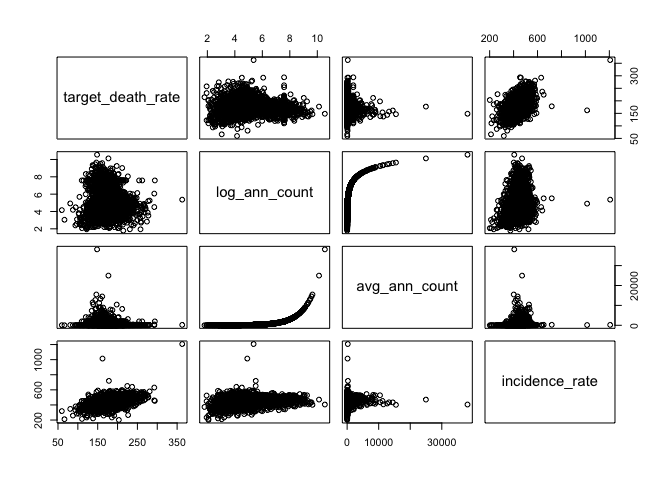
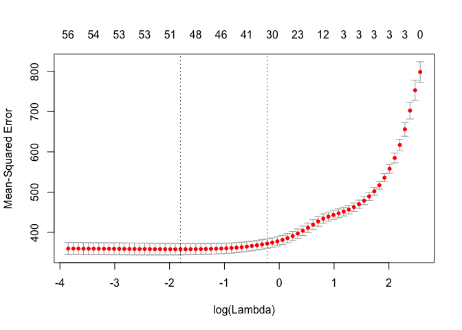
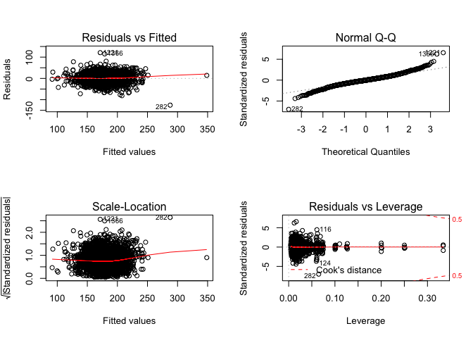
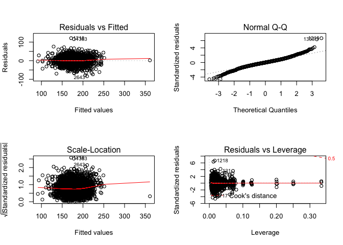

Detailed coding process
================

Data exploration and cleaning
-----------------------------

``` r
# import data
cancer = read_csv('./data/Cancer_Registry.csv') %>%
  janitor::clean_names() %>%
  mutate(state = str_replace(str_extract(geography, ', .*'), ', ', ''), # group counties by state
         log_ann_count = log(avg_ann_count), # log transformations
         log_deaths_yr = log(avg_deaths_per_year),
         log_pop = log(pop_est2015),
         pct_black_bin = ifelse(pct_black >= 5, 1, 0), # add small decimal 
         pct_asian_bin = ifelse(pct_asian >= 5, 1, 0),
         pct_other_race_bin = ifelse(pct_other_race >= 5, 1, 0),
         pct_minority = 100 - pct_white,
         pct_minority_bin = ifelse(pct_minority >= 20, 1, 0),
         log_minority = log(pct_minority),
         region = ifelse(state %in% NE.name, 'Northeast', NA), # bin states by geographic region
         region = ifelse(state %in% MW.name, 'Midwest', region),
         region = ifelse(state %in% S.name, 'South', region),
         region = ifelse(state %in% W.name, 'West', region),
         state = recode(state, "District of Columbia" = "Maryland"),
         pct_college = pct_bach_deg25_over + pct_bach_deg18_24,
         pct_healthinsurance = pct_private_coverage + pct_public_coverage)
```

    ## Parsed with column specification:
    ## cols(
    ##   .default = col_double(),
    ##   avgDeathsPerYear = col_integer(),
    ##   medIncome = col_integer(),
    ##   popEst2015 = col_integer(),
    ##   binnedInc = col_character(),
    ##   Geography = col_character()
    ## )

    ## See spec(...) for full column specifications.

``` r
# selection of variables based on our exploration 
cancer_varselect = cancer %>%
  dplyr::select(target_death_rate,
                log_ann_count,
                incidence_rate,
                poverty_percent,
                study_per_cap,
                median_age_male,
                avg_household_size,
                percent_married,
                pct_college,
                pct_minority,
                pct_healthinsurance,
                pct_college,
                state)


cancer %>%
  dplyr::select(target_death_rate,
                log_ann_count,
                avg_ann_count,
                incidence_rate) %>%
  pairs
```



``` r
# cancer %>%
#   group_by(state) %>%
#   ggplot(aes(y = target_death_rate, x = state)) + 
#   geom_violin() + 
#   coord_flip()
# 
# cancer %>%
#   group_by(region) %>%
#   ggplot(aes(y = target_death_rate, x = region)) + 
#   geom_violin()
# 
# cancer %>%
#   ggplot(aes(y = pct_minority, x = state)) +
#   geom_violin() +
#   coord_flip()
```

We first examined variables for any skewness, and then tested associations between covariates to identify potential sources of collinearity. We found that several sets of variables were correlated.

We saw that median age was highly skewed, to the point that we think there is some sort of data error. Keep this in mind for later; for now we remove from the list of selected parameters. We opt instead to use the median age in males as a proxy, since the distribution (discarding the outliers in median age) is comparable to median age overall and median age in females. It's also interesting to note that median age between males and females are highly correlated eith each other, but not much correlated with target death rate. In fact, median age in males is negatively correlated with death rate, while median age for females is positively correlated.

We looked again at the variables for the percent of the population of a certain race and found that log transformation was bimodal. It might make sense to make this binary (i.e. &gt;5% of a certain race or not). In the end, we chose to make a single variable measuring the percent of the population that is non-white (considered minority). This variable was skewed, but we did not perform a transformation for the sake of interpretability.

We combined several variables to create aggregate measures. We initially thought to group counties by region (Northeast, South, Midwest, West), but found that state-level groupings provided better fit and predictive capability. We designated the District of Columbia as being part of Maryland, since it had a single observation. We also created single measures for the percent of the population with a bachelor's degree and percent of the population with health insurance.

Median income and the percent of the population in poverty are correlated with each other as well as the percent of the population with a college degree. Percent in poverty had a slightly higher association with the death rate, and a slightly lower correlation with education (as measured), so we opted to include it over median income.

How do we interpret the lack of association between the number of new cancer cases and incidence rate?

Model selection
---------------

### Stepwise

``` r
# Stepwise 
step.fit = step(lm(target_death_rate ~ ., data = cancer_varselect))
```

    ## Start:  AIC=17866.42
    ## target_death_rate ~ log_ann_count + incidence_rate + poverty_percent + 
    ##     study_per_cap + median_age_male + avg_household_size + percent_married + 
    ##     pct_college + pct_minority + pct_healthinsurance + state
    ## 
    ##                       Df Sum of Sq     RSS   AIC
    ## - avg_household_size   1        40 1031144 17864
    ## - study_per_cap        1        60 1031164 17865
    ## - pct_healthinsurance  1       319 1031423 17865
    ## - log_ann_count        1       639 1031743 17866
    ## <none>                             1031104 17866
    ## - pct_minority         1      1074 1032177 17868
    ## - percent_married      1      1132 1032235 17868
    ## - median_age_male      1      2050 1033153 17870
    ## - poverty_percent      1     19207 1050311 17921
    ## - pct_college          1     67042 1098146 18056
    ## - state               49    254384 1285488 18440
    ## - incidence_rate       1    232406 1263509 18484
    ## 
    ## Step:  AIC=17864.54
    ## target_death_rate ~ log_ann_count + incidence_rate + poverty_percent + 
    ##     study_per_cap + median_age_male + percent_married + pct_college + 
    ##     pct_minority + pct_healthinsurance + state
    ## 
    ##                       Df Sum of Sq     RSS   AIC
    ## - study_per_cap        1        63 1031207 17863
    ## - pct_healthinsurance  1       358 1031503 17864
    ## - log_ann_count        1       633 1031777 17864
    ## <none>                             1031144 17864
    ## - percent_married      1      1102 1032247 17866
    ## - pct_minority         1      1105 1032249 17866
    ## - median_age_male      1      2013 1033158 17868
    ## - poverty_percent      1     19168 1050312 17919
    ## - pct_college          1     67361 1098505 18055
    ## - state               49    254551 1285695 18439
    ## - incidence_rate       1    232540 1263684 18482
    ## 
    ## Step:  AIC=17862.73
    ## target_death_rate ~ log_ann_count + incidence_rate + poverty_percent + 
    ##     median_age_male + percent_married + pct_college + pct_minority + 
    ##     pct_healthinsurance + state
    ## 
    ##                       Df Sum of Sq     RSS   AIC
    ## - pct_healthinsurance  1       354 1031561 17862
    ## - log_ann_count        1       613 1031820 17862
    ## <none>                             1031207 17863
    ## - pct_minority         1      1090 1032296 17864
    ## - percent_married      1      1146 1032353 17864
    ## - median_age_male      1      2009 1033216 17867
    ## - poverty_percent      1     19152 1050358 17917
    ## - pct_college          1     67303 1098510 18053
    ## - state               49    254722 1285929 18437
    ## - incidence_rate       1    233181 1264387 18482
    ## 
    ## Step:  AIC=17861.77
    ## target_death_rate ~ log_ann_count + incidence_rate + poverty_percent + 
    ##     median_age_male + percent_married + pct_college + pct_minority + 
    ##     state
    ## 
    ##                   Df Sum of Sq     RSS   AIC
    ## - log_ann_count    1       621 1032181 17862
    ## <none>                         1031561 17862
    ## - percent_married  1       994 1032555 17863
    ## - pct_minority     1      1364 1032924 17864
    ## - median_age_male  1      1676 1033236 17865
    ## - poverty_percent  1     21858 1053418 17924
    ## - pct_college      1     68668 1100229 18056
    ## - state           49    255142 1286703 18437
    ## - incidence_rate   1    234196 1265756 18483
    ## 
    ## Step:  AIC=17861.6
    ## target_death_rate ~ incidence_rate + poverty_percent + median_age_male + 
    ##     percent_married + pct_college + pct_minority + state
    ## 
    ##                   Df Sum of Sq     RSS   AIC
    ## <none>                         1032181 17862
    ## - percent_married  1       888 1033069 17862
    ## - pct_minority     1      1251 1033433 17863
    ## - median_age_male  1      2406 1034587 17867
    ## - poverty_percent  1     23676 1055857 17929
    ## - pct_college      1     81874 1114055 18092
    ## - state           49    256520 1288702 18440
    ## - incidence_rate   1    243683 1275864 18505

``` r
summary(step.fit)
```

    ## 
    ## Call:
    ## lm(formula = target_death_rate ~ incidence_rate + poverty_percent + 
    ##     median_age_male + percent_married + pct_college + pct_minority + 
    ##     state, data = cancer_varselect)
    ## 
    ## Residuals:
    ##      Min       1Q   Median       3Q      Max 
    ## -125.889  -10.255   -0.138   10.407  120.745 
    ## 
    ## Coefficients:
    ##                       Estimate Std. Error t value Pr(>|t|)    
    ## (Intercept)          92.517066   8.335395  11.099  < 2e-16 ***
    ## incidence_rate        0.196252   0.007385  26.573  < 2e-16 ***
    ## poverty_percent       0.834496   0.100749   8.283  < 2e-16 ***
    ## median_age_male       0.215217   0.081510   2.640 0.008324 ** 
    ## percent_married      -0.152040   0.094798  -1.604 0.108859    
    ## pct_college          -0.793974   0.051547 -15.403  < 2e-16 ***
    ## pct_minority          0.069130   0.036303   1.904 0.056978 .  
    ## stateAlaska          20.051469   5.086719   3.942 8.27e-05 ***
    ## stateArizona        -20.868658   5.402043  -3.863 0.000114 ***
    ## stateArkansas        13.641470   3.198764   4.265 2.06e-05 ***
    ## stateCalifornia     -16.677290   3.442214  -4.845 1.33e-06 ***
    ## stateColorado       -18.377617   3.500704  -5.250 1.63e-07 ***
    ## stateConnecticut    -14.021961   7.062924  -1.985 0.047203 *  
    ## stateDelaware        -6.624899  11.002924  -0.602 0.547151    
    ## stateFlorida         -2.903048   3.326607  -0.873 0.382910    
    ## stateGeorgia         -8.641370   2.779285  -3.109 0.001894 ** 
    ## stateHawaii         -26.601364   9.725760  -2.735 0.006272 ** 
    ## stateIdaho          -21.475406   3.785455  -5.673 1.54e-08 ***
    ## stateIllinois        -1.120685   3.074543  -0.365 0.715507    
    ## stateIndiana          8.497400   3.155340   2.693 0.007120 ** 
    ## stateIowa           -10.536212   3.115893  -3.381 0.000730 ***
    ## stateKansas          -6.806300   3.076749  -2.212 0.027030 *  
    ## stateKentucky        13.541069   3.035297   4.461 8.45e-06 ***
    ## stateLouisiana        0.435296   3.306454   0.132 0.895270    
    ## stateMaine            2.362797   5.301797   0.446 0.655875    
    ## stateMaryland         3.494938   4.473664   0.781 0.434732    
    ## stateMassachusetts   -6.168766   5.632690  -1.095 0.273529    
    ## stateMichigan        -0.503461   3.196222  -0.158 0.874848    
    ## stateMinnesota      -11.920124   3.184478  -3.743 0.000185 ***
    ## stateMississippi      5.127154   3.131103   1.637 0.101633    
    ## stateMissouri         9.061784   3.005761   3.015 0.002593 ** 
    ## stateMontana        -15.858994   3.617035  -4.385 1.20e-05 ***
    ## stateNebraska        -9.110362   3.246177  -2.806 0.005041 ** 
    ## stateNevada          -5.754164   5.137736  -1.120 0.262812    
    ## stateNew Hampshire   -4.146851   6.429868  -0.645 0.519018    
    ## stateNew Jersey      -5.041828   4.788614  -1.053 0.292482    
    ## stateNew Mexico     -19.545026   4.112505  -4.753 2.10e-06 ***
    ## stateNew York       -13.550735   3.443665  -3.935 8.51e-05 ***
    ## stateNorth Carolina  -8.526499   3.002790  -2.840 0.004549 ** 
    ## stateNorth Dakota    -6.362623   3.600226  -1.767 0.077283 .  
    ## stateOhio             6.861420   3.172556   2.163 0.030640 *  
    ## stateOklahoma        12.292137   3.182076   3.863 0.000114 ***
    ## stateOregon         -10.282039   3.939691  -2.610 0.009103 ** 
    ## statePennsylvania    -7.094532   3.380803  -2.098 0.035947 *  
    ## stateRhode Island    -4.230352   8.723751  -0.485 0.627766    
    ## stateSouth Carolina  -0.478816   3.617071  -0.132 0.894695    
    ## stateSouth Dakota   -10.444768   3.421377  -3.053 0.002287 ** 
    ## stateTennessee       10.180561   3.080542   3.305 0.000962 ***
    ## stateTexas           -2.646909   2.730937  -0.969 0.332508    
    ## stateUtah           -27.007939   4.438576  -6.085 1.31e-09 ***
    ## stateVermont          2.228442   5.604772   0.398 0.690955    
    ## stateVirginia         6.013171   2.929643   2.053 0.040205 *  
    ## stateWashington     -10.391640   3.831085  -2.712 0.006717 ** 
    ## stateWest Virginia    8.120129   3.530804   2.300 0.021528 *  
    ## stateWisconsin       -2.374039   3.306385  -0.718 0.472803    
    ## stateWyoming         -6.752325   4.628975  -1.459 0.144750    
    ## ---
    ## Signif. codes:  0 '***' 0.001 '**' 0.01 '*' 0.05 '.' 0.1 ' ' 1
    ## 
    ## Residual standard error: 18.58 on 2991 degrees of freedom
    ## Multiple R-squared:   0.56,  Adjusted R-squared:  0.5519 
    ## F-statistic: 69.21 on 55 and 2991 DF,  p-value: < 2.2e-16

### Lasso Model Selection

``` r
## Lasso on selected variables
set.seed(1)
Y <- cancer_varselect$target_death_rate
X <- model.matrix( ~ . , data = cancer_varselect[,-1])
train <- sample(1:nrow(X), nrow(X)/2)
grid <- 10^seq(5, -2, length = 100)

# lasso1 <- glmnet(X[train ,],Y[train], alpha = 1, lambda = grid)
cv.out <- cv.glmnet(X[train,],Y[train]) # all possible lambda values

par(mfrow = c(1, 1))
plot(cv.out) # CV process
```



``` r
coef(glmnet(X, Y, alpha = 1, lambda = cv.out$lambda.min)) # fitting with chosen lambda
```

    ## 61 x 1 sparse Matrix of class "dgCMatrix"
    ##                               s0
    ## (Intercept)          92.75426140
    ## (Intercept)           .         
    ## log_ann_count        -0.37404842
    ## incidence_rate        0.19814777
    ## poverty_percent       0.85823886
    ## study_per_cap         .         
    ## median_age_male       0.12542051
    ## avg_household_size    .         
    ## percent_married      -0.12711057
    ## pct_college          -0.78656762
    ## pct_minority          0.05824293
    ## pct_healthinsurance   .         
    ## stateAlaska          20.37430699
    ## stateArizona        -15.18673884
    ## stateArkansas        15.25677164
    ## stateCalifornia     -12.09836191
    ## stateColorado       -14.63764027
    ## stateConnecticut     -7.10120860
    ## stateDelaware         .         
    ## stateFlorida          .         
    ## stateGeorgia         -5.30903457
    ## stateHawaii         -18.01020414
    ## stateIdaho          -17.83993196
    ## stateIllinois         0.70248025
    ## stateIndiana         10.22005555
    ## stateIowa            -7.14957076
    ## stateKansas          -2.39147442
    ## stateKentucky        14.99646083
    ## stateLouisiana        2.01181102
    ## stateMaine            3.38916188
    ## stateMaryland         5.12173592
    ## stateMassachusetts   -0.13034452
    ## stateMichigan         1.64654762
    ## stateMinnesota       -7.32766901
    ## stateMississippi      6.75287037
    ## stateMissouri        10.74617870
    ## stateMontana        -12.05936004
    ## stateNebraska        -5.82634085
    ## stateNevada           .         
    ## stateNew Hampshire    .         
    ## stateNew Jersey       .         
    ## stateNew Mexico     -15.05854192
    ## stateNew York        -9.13040049
    ## stateNorth Carolina  -4.55632509
    ## stateNorth Dakota    -2.81120274
    ## stateOhio             8.82847281
    ## stateOklahoma        13.78109269
    ## stateOregon          -5.75658073
    ## statePennsylvania    -2.72279776
    ## stateRhode Island     .         
    ## stateSouth Carolina   1.37675308
    ## stateSouth Dakota    -7.13492511
    ## stateTennessee       11.95755498
    ## stateTexas            .         
    ## stateUtah           -23.42351500
    ## stateVermont          2.76570508
    ## stateVirginia         8.14293829
    ## stateWashington      -5.90170108
    ## stateWest Virginia    9.64499881
    ## stateWisconsin        .         
    ## stateWyoming         -2.46030219

``` r
(glmnet(X, Y, alpha = 1, lambda = cv.out$lambda.min))$dev.ratio
```

    ## [1] 0.5583722

When we test our original selected variables with a Lasso model, we find that the number of new cases remains a meaningful predictor. However, the percent of people with health insurance is down-weighted.

We also tried fitting Lasso on the full original dataset (with our transformed/grouped variables) and found that many of the covariates appeared meaningful. However, this model was seen to be overfitting the data.

The stepwise process eliminated the percent of the population with health insurance as a predictor of cancer mortality per capita. However, we suspect this may be a practically meaningful covariate, since it has been shown that those with health insurance tend to have improved cancer outcomes over those without health insurance. This was done on an individual level (<https://www.ncbi.nlm.nih.gov/pubmed/29192307>) and by relating individual insurance coverage with communities (<https://www.ncbi.nlm.nih.gov/pmc/articles/PMC5360496/>). \[Are we at risk of an atomistic fallacy?\]

Our final model uses cancer incidence, percent of the population in poverty, median age, percent of the population that is married, percent of the population with a college degree, percent of the population that is non-white, and the percent of the population with health insurance to predict the average cancer death rate per 100,000 across states.

``` r
# Decided model based on stepwise and decision about meaningful covariates
final.model = lm(target_death_rate ~ incidence_rate + poverty_percent + 
    median_age_male + percent_married + pct_college + pct_minority + pct_healthinsurance +
    state, 
    data = cancer_varselect)
summary(final.model)
```

    ## 
    ## Call:
    ## lm(formula = target_death_rate ~ incidence_rate + poverty_percent + 
    ##     median_age_male + percent_married + pct_college + pct_minority + 
    ##     pct_healthinsurance + state, data = cancer_varselect)
    ## 
    ## Residuals:
    ##      Min       1Q   Median       3Q      Max 
    ## -125.648  -10.316   -0.094   10.320  121.087 
    ## 
    ## Coefficients:
    ##                      Estimate Std. Error t value Pr(>|t|)    
    ## (Intercept)         100.28240   11.26940   8.899  < 2e-16 ***
    ## incidence_rate        0.19717    0.00744  26.502  < 2e-16 ***
    ## poverty_percent       0.80725    0.10420   7.747 1.28e-14 ***
    ## median_age_male       0.26584    0.09533   2.789 0.005328 ** 
    ## percent_married      -0.16589    0.09576  -1.732 0.083307 .  
    ## pct_college          -0.78896    0.05178 -15.237  < 2e-16 ***
    ## pct_minority          0.06244    0.03689   1.693 0.090619 .  
    ## pct_healthinsurance  -0.08680    0.08478  -1.024 0.305980    
    ## stateAlaska          18.82816    5.22511   3.603 0.000319 ***
    ## stateArizona        -20.98771    5.40325  -3.884 0.000105 ***
    ## stateArkansas        13.38820    3.20829   4.173 3.09e-05 ***
    ## stateCalifornia     -17.02226    3.45864  -4.922 9.05e-07 ***
    ## stateColorado       -19.01753    3.55603  -5.348 9.57e-08 ***
    ## stateConnecticut    -14.21842    7.06547  -2.012 0.044269 *  
    ## stateDelaware        -6.40428   11.00494  -0.582 0.560647    
    ## stateFlorida         -3.48868    3.37540  -1.034 0.301425    
    ## stateGeorgia         -9.19951    2.83222  -3.248 0.001174 ** 
    ## stateHawaii         -26.13480    9.73635  -2.684 0.007309 ** 
    ## stateIdaho          -21.96516    3.81553  -5.757 9.44e-09 ***
    ## stateIllinois        -1.03574    3.07564  -0.337 0.736324    
    ## stateIndiana          8.14324    3.17422   2.565 0.010353 *  
    ## stateIowa           -10.32746    3.12253  -3.307 0.000953 ***
    ## stateKansas          -6.86138    3.07720  -2.230 0.025838 *  
    ## stateKentucky        13.32938    3.04231   4.381 1.22e-05 ***
    ## stateLouisiana       -0.01578    3.33565  -0.005 0.996227    
    ## stateMaine            2.02703    5.31189   0.382 0.702783    
    ## stateMaryland         3.54035    4.47385   0.791 0.428807    
    ## stateMassachusetts   -5.98884    5.63539  -1.063 0.287994    
    ## stateMichigan        -0.32980    3.20069  -0.103 0.917938    
    ## stateMinnesota      -11.71145    3.19097  -3.670 0.000247 ***
    ## stateMississippi      4.82173    3.14526   1.533 0.125378    
    ## stateMissouri         8.71727    3.02451   2.882 0.003977 ** 
    ## stateMontana        -16.49714    3.67031  -4.495 7.23e-06 ***
    ## stateNebraska        -9.18128    3.24689  -2.828 0.004719 ** 
    ## stateNevada          -6.52725    5.19288  -1.257 0.208866    
    ## stateNew Hampshire   -4.63531    6.44749  -0.719 0.472239    
    ## stateNew Jersey      -5.49974    4.80941  -1.144 0.252908    
    ## stateNew Mexico     -19.90396    4.12739  -4.822 1.49e-06 ***
    ## stateNew York       -13.54026    3.44365  -3.932 8.62e-05 ***
    ## stateNorth Carolina  -8.86693    3.02112  -2.935 0.003361 ** 
    ## stateNorth Dakota    -6.32977    3.60034  -1.758 0.078832 .  
    ## stateOhio             6.78113    3.17350   2.137 0.032695 *  
    ## stateOklahoma        11.82671    3.21435   3.679 0.000238 ***
    ## stateOregon         -10.44556    3.94290  -2.649 0.008110 ** 
    ## statePennsylvania    -7.05488    3.38100  -2.087 0.037006 *  
    ## stateRhode Island    -4.35380    8.72451  -0.499 0.617795    
    ## stateSouth Carolina  -0.69506    3.62320  -0.192 0.847885    
    ## stateSouth Dakota   -10.52548    3.42226  -3.076 0.002120 ** 
    ## stateTennessee        9.92815    3.09036   3.213 0.001329 ** 
    ## stateTexas           -3.49407    2.85351  -1.224 0.220866    
    ## stateUtah           -27.34280    4.45057  -6.144 9.13e-10 ***
    ## stateVermont          2.19140    5.60484   0.391 0.695837    
    ## stateVirginia         5.80773    2.93648   1.978 0.048045 *  
    ## stateWashington     -10.54644    3.83404  -2.751 0.005982 ** 
    ## stateWest Virginia    7.97444    3.53364   2.257 0.024098 *  
    ## stateWisconsin       -2.37633    3.30636  -0.719 0.472374    
    ## stateWyoming         -7.21056    4.65052  -1.550 0.121131    
    ## ---
    ## Signif. codes:  0 '***' 0.001 '**' 0.01 '*' 0.05 '.' 0.1 ' ' 1
    ## 
    ## Residual standard error: 18.58 on 2990 degrees of freedom
    ## Multiple R-squared:  0.5602, Adjusted R-squared:  0.5519 
    ## F-statistic:    68 on 56 and 2990 DF,  p-value: < 2.2e-16

Model diagnostics
-----------------

Testing assumptions for model selected by stepqise regression:

``` r
par(mfrow = c(2, 2))
plot(final.model)
```



We see that there are long tails on both sides of the distribution. This may be due to outliers at either extreme, so next we examine presence of outliers and potentially influential points.

``` r
stu_res <- rstandard(final.model)
outliers_y <- stu_res[abs(stu_res) > 2.5] # there are 71 outliers

# None of the points lie beyond a Cook's distane of 0.5, but point 116, 124, and 282 are noted

# Examine results with and without observations 5 and 28 that have very high survivals (>2000)
cancer_influential = cancer_varselect[c(116, 124, 282), ] # only potential influencers
cancer_noinfluential = cancer_varselect[-c(116, 124, 282), ] # all rows except potential influencers

fit_noinfluential <- lm(target_death_rate ~ log_ann_count + incidence_rate + poverty_percent + 
    median_age_male + percent_married + pct_college + pct_minority + pct_healthinsurance +
    state, data = cancer_noinfluential)


summary(fit_noinfluential)
```

    ## 
    ## Call:
    ## lm(formula = target_death_rate ~ log_ann_count + incidence_rate + 
    ##     poverty_percent + median_age_male + percent_married + pct_college + 
    ##     pct_minority + pct_healthinsurance + state, data = cancer_noinfluential)
    ## 
    ## Residuals:
    ##     Min      1Q  Median      3Q     Max 
    ## -83.542 -10.296  -0.101  10.279 121.048 
    ## 
    ## Coefficients:
    ##                       Estimate Std. Error t value Pr(>|t|)    
    ## (Intercept)          99.778553  11.377816   8.770  < 2e-16 ***
    ## log_ann_count        -0.816333   0.394767  -2.068 0.038737 *  
    ## incidence_rate        0.212853   0.007792  27.318  < 2e-16 ***
    ## poverty_percent       0.799900   0.104062   7.687 2.03e-14 ***
    ## median_age_male       0.190490   0.096709   1.970 0.048962 *  
    ## percent_married      -0.197426   0.094919  -2.080 0.037616 *  
    ## pct_college          -0.740304   0.054167 -13.667  < 2e-16 ***
    ## pct_minority          0.053922   0.036522   1.476 0.139939    
    ## pct_healthinsurance  -0.068893   0.083662  -0.823 0.410305    
    ## stateAlaska          18.274461   5.215604   3.504 0.000465 ***
    ## stateArizona        -18.662346   5.359314  -3.482 0.000504 ***
    ## stateArkansas        13.536831   3.166169   4.275 1.97e-05 ***
    ## stateCalifornia     -15.921997   3.431567  -4.640 3.64e-06 ***
    ## stateColorado       -19.070072   3.533576  -5.397 7.31e-08 ***
    ## stateConnecticut    -13.823275   6.977849  -1.981 0.047680 *  
    ## stateDelaware        -6.109125  10.861871  -0.562 0.573860    
    ## stateFlorida         -2.312354   3.354552  -0.689 0.490676    
    ## stateGeorgia         -9.422482   2.802105  -3.363 0.000782 ***
    ## stateHawaii         -24.351594   9.610114  -2.534 0.011329 *  
    ## stateIdaho          -22.301423   3.780513  -5.899 4.07e-09 ***
    ## stateIllinois        -1.851192   3.041770  -0.609 0.542842    
    ## stateIndiana          7.967446   3.132691   2.543 0.011030 *  
    ## stateIowa           -11.367077   3.108839  -3.656 0.000260 ***
    ## stateKansas          -5.271469   3.122908  -1.688 0.091516 .  
    ## stateKentucky        12.152023   3.009146   4.038 5.52e-05 ***
    ## stateLouisiana       -0.567987   3.294497  -0.172 0.863131    
    ## stateMaine            1.978804   5.241196   0.378 0.705793    
    ## stateMaryland         3.670966   4.413281   0.832 0.405588    
    ## stateMassachusetts   -6.155750   5.562536  -1.107 0.268537    
    ## stateMichigan         0.146253   3.159791   0.046 0.963086    
    ## stateMinnesota      -10.232876   3.225148  -3.173 0.001525 ** 
    ## stateMississippi      4.224236   3.115461   1.356 0.175235    
    ## stateMissouri         8.593482   2.987964   2.876 0.004056 ** 
    ## stateMontana        -17.445387   3.665292  -4.760 2.03e-06 ***
    ## stateNebraska       -10.011966   3.260303  -3.071 0.002154 ** 
    ## stateNevada          -5.457173   5.430158  -1.005 0.314990    
    ## stateNew Hampshire   -4.873730   6.360452  -0.766 0.443585    
    ## stateNew Jersey      -5.294743   4.751599  -1.114 0.265237    
    ## stateNew Mexico     -19.254750   4.073306  -4.727 2.38e-06 ***
    ## stateNew York       -13.850654   3.401798  -4.072 4.79e-05 ***
    ## stateNorth Carolina  -8.642233   2.980477  -2.900 0.003763 ** 
    ## stateNorth Dakota    -7.661827   3.649142  -2.100 0.035846 *  
    ## stateOhio             7.095532   3.133848   2.264 0.023636 *  
    ## stateOklahoma        11.636324   3.183082   3.656 0.000261 ***
    ## stateOregon         -10.236984   3.889516  -2.632 0.008534 ** 
    ## statePennsylvania    -7.012894   3.341462  -2.099 0.035923 *  
    ## stateRhode Island    -4.777730   8.606206  -0.555 0.578834    
    ## stateSouth Carolina  -0.316179   3.574707  -0.088 0.929526    
    ## stateSouth Dakota   -11.918756   3.468257  -3.437 0.000597 ***
    ## stateTennessee        9.759061   3.048445   3.201 0.001382 ** 
    ## stateTexas           -3.189706   2.825833  -1.129 0.259087    
    ## stateUtah           -27.556333   4.413203  -6.244 4.87e-10 ***
    ## stateVermont          1.261306   5.536659   0.228 0.819810    
    ## stateVirginia         6.544193   2.914866   2.245 0.024834 *  
    ## stateWashington     -10.142733   3.782704  -2.681 0.007373 ** 
    ## stateWest Virginia    7.700520   3.486225   2.209 0.027261 *  
    ## stateWisconsin       -2.302701   3.261742  -0.706 0.480260    
    ## stateWyoming         -7.575041   4.612661  -1.642 0.100648    
    ## ---
    ## Signif. codes:  0 '***' 0.001 '**' 0.01 '*' 0.05 '.' 0.1 ' ' 1
    ## 
    ## Residual standard error: 18.32 on 2986 degrees of freedom
    ## Multiple R-squared:  0.5707, Adjusted R-squared:  0.5625 
    ## F-statistic: 69.64 on 57 and 2986 DF,  p-value: < 2.2e-16

``` r
par(mfrow = c(2, 2))
plot(fit_noinfluential)
```



Skewness still exists without these influential points, but the model's R2 and Adj R2 both improve slightly.

What is the takeaway?

Model validation
----------------

K-fold CV

``` r
kfold_cv = lapply(1:10, function(i){
  # create 10-fold training datasets
  data_train <- trainControl(method = "cv", number = 10)

  # Fit the model used above
  model_caret <- train((target_death_rate ~ log_ann_count + incidence_rate + poverty_percent + median_age_male + percent_married + pct_college + pct_minority + pct_healthinsurance + state),
                     data = cancer_varselect,
                     trControl = data_train,
                     method = 'lm',
                     na.action = na.pass)
  
  #return(list(model_caret$results, model_caret$resample))
  return(model_caret$results)
})

do.call("rbind", kfold_cv) %>%
  dplyr::select(RMSE, RMSESD) %>% # summarise(mse = mean(RMSE))
  mutate(MSE = RMSE^2,
         std.error = RMSESD / 9) %>%
  dplyr::select(1, 3, 2, 4) %>% summarise(MSE = mean(MSE),
                                          RMSE = mean(RMSE),
                                          SE = mean(std.error)) %>%
  knitr::kable()
```

|       MSE|      RMSE|         SE|
|---------:|---------:|----------:|
|  351.8327|  18.75719|  0.1241792|

Our 10-fold cross validation shows root MSE of ~18.7. Performing leave-one-out (N-fold) cross validation gives a comparable value. We also examine other criteria (SSE, R-squared, and PRESS):

Criterion comparison

``` r
newsummary <- function(model)
{
    list('coefs'    = round(t(summary(model)$coef[, 1:2]), 4),
         'criteria' = cbind('SSE'   = anova(model)["Residuals", "Sum Sq"],
                            'PRESS' = PRESS(model),
                            'MSE'   = anova(model)["Residuals", "Mean Sq"],
                            'Adjusted Rsq'   = summary(model)$adj.r.squared))
}

newsummary(lm(target_death_rate ~ log_ann_count + incidence_rate + poverty_percent + 
    median_age_male + percent_married + pct_college + pct_minority + pct_healthinsurance +
    state, data = cancer_varselect))$criteria %>%
  knitr::kable()
```

|      SSE|    PRESS|       MSE|  Adjusted Rsq|
|--------:|--------:|---------:|-------------:|
|  1031207|  1074002|  345.0006|     0.5520325|

Commentary
----------
