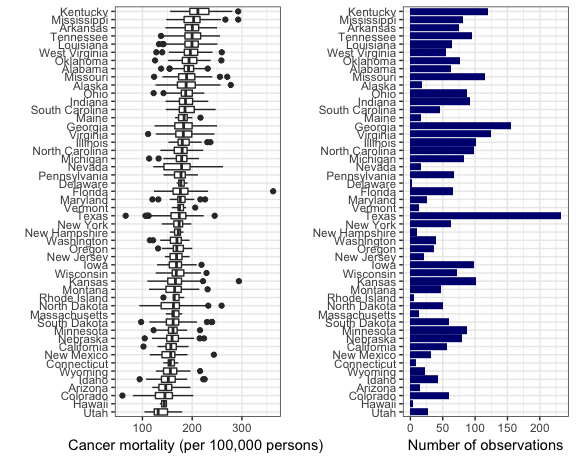

Exploratory Plot
================
Runqi Ma
2018/12/15

``` r
cancer_varselect %>%
  dplyr::select(-state) %>% 
  gather() %>%
  as.data.frame() %>% 
  ggplot(aes(x = value)) +
  geom_histogram() +
  facet_wrap(~ key, scales = "free_x")
```

    ## `stat_bin()` using `bins = 30`. Pick better value with `binwidth`.


``` r
cancer_varselect %>%
  dplyr::select(-state) %>% 
  gather() %>%
  as.data.frame() %>% 
  ggplot(aes(y = value)) +
  geom_violin(aes(x = 1,y = value)) +
  geom_boxplot() +
  facet_wrap(~ key, scales = "free_y") 
```


``` r
cancer_varselect %>%
  dplyr::select(state, target_death_rate) %>% 
  mutate(state = fct_reorder(state, target_death_rate)) %>% 
  ggplot(aes(x = state, y = target_death_rate) ) +
  geom_boxplot() +
  theme_bw() +
  coord_flip() +
  theme(axis.text.x = element_text(angle = 90, hjust = 1))
```


``` r
cancer_varselect %>%
  dplyr::select(-state) %>% 
  gather(key = key, value = value, log_ann_count:pct_healthinsurance) %>%
  as.data.frame() %>% 
  ggplot(aes(x = value, y = target_death_rate)) +
  geom_point(alpha = .1) +
  geom_smooth(se = FALSE) +
  facet_wrap(~ key, scales = "free_x")
```

    ## `geom_smooth()` using method = 'gam' and formula 'y ~ s(x, bs = "cs")'


